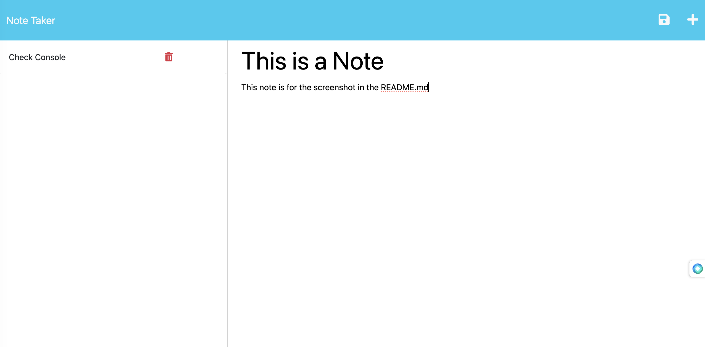

# NoteTaker

  

  ## Description
Can be used to write and save notes. This application will use an Express.js back end and will save and retrieve note data from a JSON file

  ## Table of Contents
  * [Installation](#installation)
  * [Usage](#usage)
  * [License](#license)
  * [Contribution](#contribution)
  * [Tests](#tests)
  * [Questions](#questions)
  

  ## Installation
  Note Taker is deployed through Heroku at the URL below, follow and then click Open App button
  https://dashboard.heroku.com/apps/agile-savannah-73372

## Usage
Once App is opened, begin by titling your new note in the 'Note Title' section. The body of your note will go below in the section labeled 'Note Text'. After your have finished typing your note click the floppy disk icon in the upper right corner. Your note will now appear in the column on the left. If you want to delete a note click the trash icon and it will be removed from the list. 

## License
      
      This project is Licensed under MIT

## Contributions
There was assistance from tutor C.Hayes debugging the code within this app.
The repo is open to public contribution

## Tests
See install instructions

## Questions
If you have any questions or would like to contact me, you can reach me at [logogenerator@msn.com](mailto:logogenerator@msn.com)

If you'd like to see more of my projects, you can check them out on my GitHub: [RedactdName](https://github.com/RedactdName)
